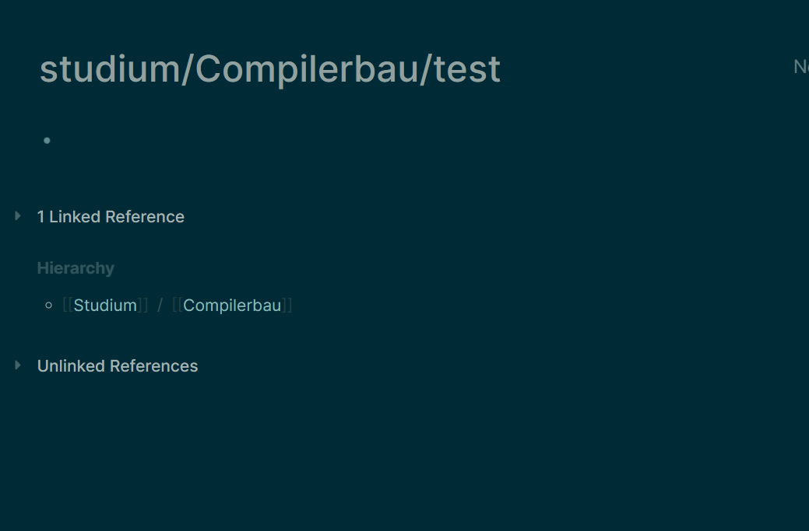

# Page in Namespace

This Plugin allows you to conveniently create a link to a (potentially non-existent) page in the current namespace.
The current namespace is the namespace of the page you are currently on.

Slash commands provided by this plugin:
-  `/Page reference in Namespace`
   -  this will add `[[current/namespace/My Page]]` to where you call the command
-  `/Page embed in Namespace`
   - this will add `{{embed [[current/namespace/My Page]]}}` to where you call the command

# Development
1. Clone
2. Run `npm install`
3. Run `npm run build`
4. In logseq, click `Plugins` which is in right top dropdown menu
5. Click `Load unpacked plugin` button and select the `dist` sub directory.
6. If plugin not work, you can try to disable and enable the plugin by clicking the switch button on Plugins page.
